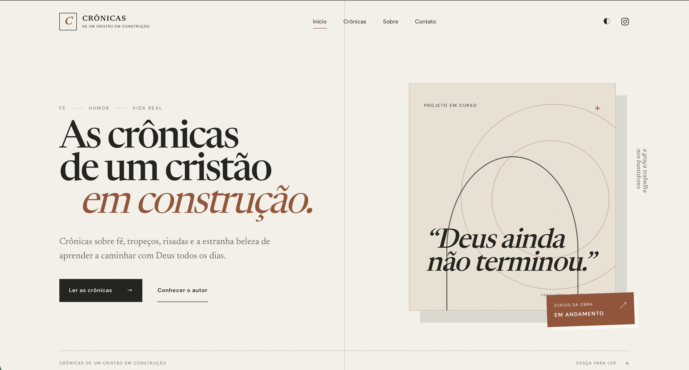

<p align="center">
  
</p>

# Crônicas de um Cristão em Construção

CMS editorial próprio desenvolvido com PHP 8, PDO SQLite, HTML semântico, CSS e JavaScript Vanilla.

# Crônicas de um Cristão em Construção

CMS editorial próprio e leve, construído com PHP 8, PDO SQLite, HTML semântico, CSS e JavaScript Vanilla.

## Requisitos

- PHP 8.1 ou superior.
- Extensões `PDO`, `pdo_sqlite`, `sqlite3`, `mbstring`, `fileinfo` e `dom`.
- Permissão de escrita na pasta que armazenará o SQLite e em `uploads/posts`.

## Primeira execução

```bash
cd /Users/biaphraaraujo/Documents/ProjetosDev/blog
php database/seed.php
php -S localhost:8000
```

Ao abrir a aplicação com um SQLite novo, o schema mínimo é criado automaticamente para evitar uma inicialização parcial. O seed continua necessário para carregar as crônicas iniciais e criar o administrador.

Acessos:

- Site: `http://localhost:8000`
- Painel: `http://localhost:8000/admin`

Credencial administrativa local criada pelo seed:

- E-mail: `admin@example.local`
- Senha temporária: gerada aleatoriamente e exibida uma única vez no terminal.

Para definir uma credencial própria, informe uma senha com ao menos 16 caracteres:

```bash
APP_ENV=local ADMIN_EMAIL=admin@example.local
ADMIN_PASSWORD='crie_uma_senha' php database/seed.php
```

Em `APP_ENV=production`, o seed se recusa a criar/atualizar o administrador sem `ADMIN_PASSWORD`. Guarde a senha temporária local em um gerenciador seguro; uma nova execução sem `ADMIN_PASSWORD` gera outra senha e invalida a anterior.

## Arquitetura

```text
admin/          painel, autenticação e CRUD editorial
components/     componentes do front público
database/       schema e seed idempotente
includes/       configuração, PDO, autenticação e helpers
repositories/   acesso centralizado a posts, categorias e configurações
uploads/posts/  imagens destacadas validadas
storage/logs/   logs da aplicação
data/posts.php  conteúdo legado usado somente pelo seed inicial
```

Por segurança, o banco padrão fica fora da raiz servida pelo PHP:

```text
../blog-storage/database.sqlite
```

Outro caminho pode ser definido com `DATABASE_PATH`.
Logs, mensagens de contato e assinaturas de newsletter também ficam nesse diretório privado. O caminho pode ser alterado com `PRIVATE_STORAGE_PATH`.

## Fluxo editorial

O painel permite:

- criar, editar, duplicar, visualizar, publicar, agendar, arquivar e excluir crônicas;
- escolher uma crônica em destaque;
- cadastrar tags separadas por vírgula;
- criar e editar categorias;
- impedir a exclusão de categorias vinculadas;
- alterar identidade, autor, Instagram, newsletter e paginação;
- pesquisar e filtrar o arquivo administrativo.

O tempo de leitura é calculado automaticamente a aproximadamente 200 palavras por minuto. Posts agendados passam a ser públicos pela própria consulta quando `published_at` chega, sem cron job.

## Conteúdo e segurança

- Todas as consultas usam PDO e prepared statements.
- Formulários mutáveis usam CSRF e validação server-side.
- Login usa `password_verify()`, regeneração de sessão, cookies HttpOnly/SameSite e timeout.
- Mensagens de autenticação são genéricas.
- Exclusões usam somente POST com confirmação.
- O corpo das crônicas aceita uma allowlist pequena de HTML e remove scripts, eventos e URLs perigosas.
- Uploads aceitam somente JPG, PNG e WebP verificados por MIME, conteúdo e limite de 5 MB.
- Nomes de arquivos enviados são substituídos por identificadores aleatórios.
- A pasta de uploads bloqueia extensões executáveis em Apache.
- Erros capturados são registrados em `storage/logs/app.log` sem exibir dados sensíveis em produção.

## Ambiente

A aplicação lê variáveis reais do ambiente; nenhum carregador de `.env` foi adicionado.

```text
APP_ENV=local|production
DATABASE_PATH=/caminho/seguro/database.sqlite
PRIVATE_STORAGE_PATH=/caminho/seguro
POST_UPLOAD_PATH=/caminho/publico/uploads/posts
ADMIN_EMAIL=admin@example.local
ADMIN_PASSWORD=senha-usada-no-seed
```

Em produção:

- use HTTPS;
- mantenha `DATABASE_PATH` fora da raiz pública;
- configure permissões mínimas de arquivo;
- troque imediatamente as credenciais locais;
- revise `SITE_URL` em `includes/config.php`;
- configure backup do SQLite e rotação dos logs;
- direcione contato e newsletter aos provedores definitivos.

## SQLite e futura migração

O SQLite é acessado apenas por `includes/database.php`. As consultas ficam concentradas nos repositories. Para migrar a MySQL/MariaDB, altere o DSN e revise os poucos upserts específicos presentes no seed, em tags e configurações; páginas e componentes não contêm SQL.

## Comandos de validação

```bash
find . -name '*.php' -print0 | xargs -0 -n1 php -l
node --check assets/js/main.js
node --check assets/js/reading-progress.js
node --check admin/assets/js/admin.js
php tests/Integration/HomeDatabaseBootstrapTest.php
php tests/Security/RandomAdminCredentialTest.php
php tests/Security/PostImageUploadTest.php
```
